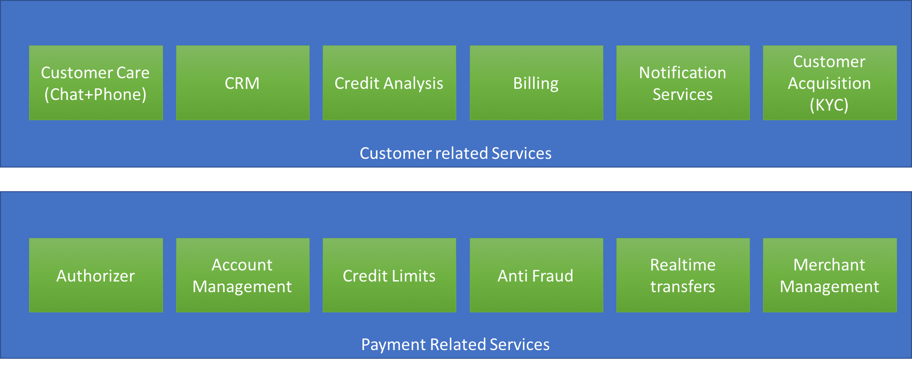
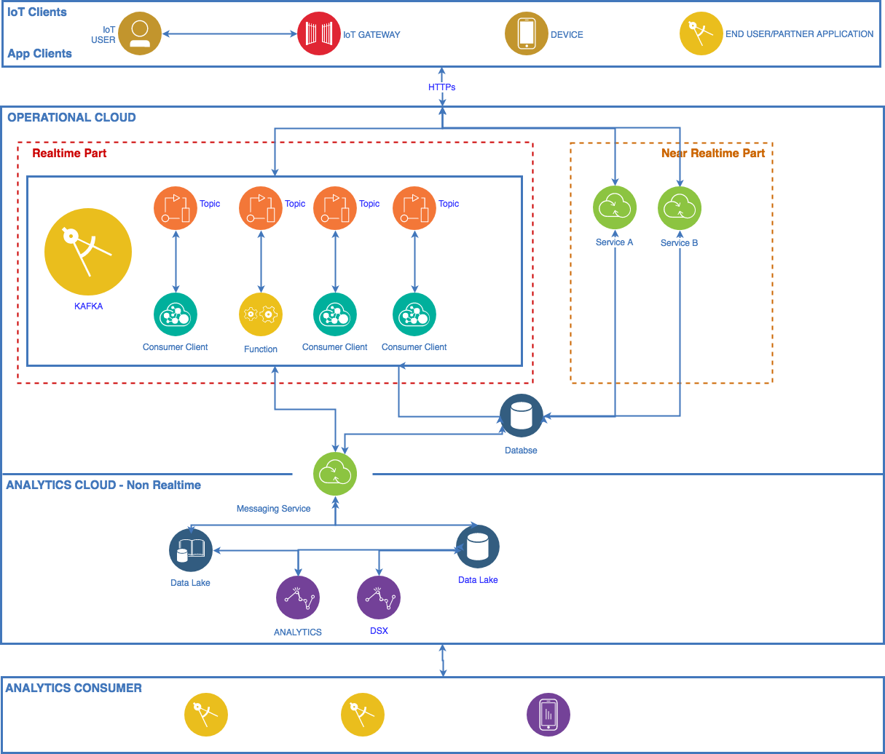

# Financial API Documentation

This API is a prototype to provide financial services for the back-office of an institution. The design, development and roadmap is intended to demonstrate a software development rationale based on best practices.

Questions to this works should be sent to `pcosta@gmail.com`.

# Build and Development

### Requirements
1. Python 3.6
2. Django 1.11.0
3. Django Rest Framework 3.6.2
4. Mysql 5.6

### Build
1. Clone git repository
```
git clone https://github.com/pedraumcosta/financialapipy.git
cd financialapipy
```

2. Run integration tests
```
python manage.py makemigrations
python manage.py migrate
python manage.py test 
```

### Run
1. Run django server to use the service.
```
python manage.py runserver
```
2. Inspect Django
```
Open your browser to: http://localhost:8000/api/v1/accounts/
```

### Current version issues and limitations
- No API authentication
- The account names are being used as an account identifier and the API uses database PK for simplicity.
- The API uses the money amount multiplied by 100 to avoid colons. 

# Solution Design
Nowadays any digital business asset must be provided as an API. Read more about the API Economy: `https://www.ibm.com/cloud/api-economy`

Even before this definition exploring a business perspective, there were frameworks that maximize the value delivered by developers at higher speeds. Basically, we want a rich set of tools allowing us to create, run, manage and secure our business functions as APIs. It is desired at least the following features, but not limited to:
- API externalization
  * API exploration
  * Self-service sign up
  * Interactive API testing
  * App key provisioning
  * API usage analytics
  * Rate limit notification
  * Multiple dev communities
- API realization
  * Multi-tenancy
  * Rate limiting
  * Runtime policy enforcement
  * API Deployment
  * OAuth secutiry management
  * Data transformation/redaction
  * Backend service discovery
  * Version Management
  * Analytics support
  * Role-based access control
  * Environment management
  * Monitoring and notification

Usually we call such solutions as API Gateways. It's difficult to separate these solutions from some cloud offerings. In fact, the combination of a comprehensive cloud solution and a good API framework may offer the best tradeoffs, since the cloud will provide additional resources, both to developers and infra people.

## Django Rest Framework

With this in mind and to particularly achieve a rapid value deliver by means of TTD development approach, this prototype was built with Django Rest Framework, which includes a lightweight server to be used locally and have a reduced boiler plate with remarkable performance. In this way the developer can work very fast and has at his disposal a very rich set of tools:
  - Browseable API
  - Auth Support
  - Serializers
  - Throttling

Additionally, Django Rest Framework is cloud agnostic, so, with minimum adaptations the code in this repo can be enhanced to be used in one of the deployment options discussed later in this `README`.

## Deployment Options
It's not the objective of this documentation to dive on the criterias to choose a particular deployment option. Personally, I would recommend a discussion based on the cloud features:
- Compute
- Storage, Backup
- Messaging
- Payment
- Scale
- Analytics
- Fault tolerance, High Availability
- Elasticity
- Security
- Identity Management, Authentication and Authorization
- Monitoring

Here are some well know deployment options for spring boot:
- Heroku
- Cloudfoundry
- IBM Cloud, It can be deployed on CloudFoundry, Kubernetes and VMs.
- Openshift
- AWS, Here is particular interesting because it can be deployed using ElasticBeanstalk, Lambda and on EC2. Probably also on the new Kubernetes service.
- Boxfuse and AWS
- Google Cloud

# Possible roadmap
A financial institution must have multiple services, several partners to interact with and provide a multitude of features to its customers. At least, but not limited to, the IT department should handle the following business process.



The best practices, most certainly, must include an hybrid microservices architecture along with an event driven platform. It is impossible and too costly to handle all this in one system and it can not be synchronous.

THIS IS A HUGE CHALLENGE. More on that TBA.

Following is a conceptual architecture


